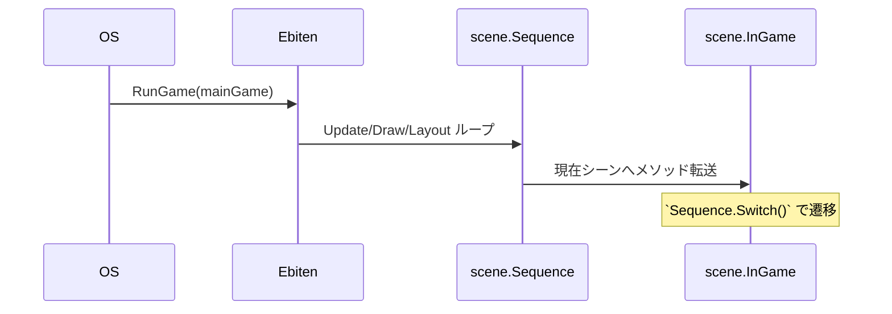

# プロジェクトアーキテクチャ概要（Union Strategy Game）

> 最終更新: 2025-06-17

本ドキュメントは **Phase 8（CSV 連携）** まで完了した現時点のコードベースを俯瞰的に説明します。新しく参加する開発者が素早く構造を理解できるよう、日本語で詳細をまとめています。

---

## 1. リポジトリ構成

| パス | 役割 |
|------|------|
| `app/` | エントリポイント (`main.go`)。Ebiten のゲームループを起動。 |
| `scene/` | トップレベルのシーン (`title`, `ingame`, `result`) と Bamenn ラッパ。 |
| `component/` | 小さな UI ウィジェット群（`ResourceView`, `Calendar`, `CardDeck`, `GameMain`, `History`）。各自が `Draw(*ebiten.Image)` を実装。 |
| `screen/` | `GameMain` 内で切り替わるサブ画面（`MapScreen`, `DiplomacyScreen`, `BattleScreen`）。 |
| `system/` | ロジック専用マネージャ（リソース管理・戦闘計算など）。UI 非依存。 |
| `entity/` | 不変データオブジェクト（カード・敵・国・マップポイント）。 |
| `loader/` | **Phase 8**: CSV ローダー（カード・国・敵・ボス）＋ `watch.go` ホットリロードポーラ。 |
| `testdata/` | ローダーユニットテスト用の最小 CSV。最終ビルドには含めない。 |
| `game_test.go` | Phase 1-7 を網羅する統合テスト。 |
| `loader/*.go` tests | Phase 8 ローダー用の単体テスト（`cards_test.go` など）。 |
| `.tdd.md` | TDD のロードマップ & チェックリスト。 |

---

## 2. 外部依存ライブラリ

* [Ebiten v2](https://github.com/hajimehoshi/ebiten) — 描画 / 入力 / メインループ。
* [Bamenn](https://github.com/noppikinatta/bamenn) — シーン管理 (`Sequence`)。
* 標準ライブラリのみで CSV とポーリング処理（`encoding/csv`, `time`, `os`）。**fsnotify 不使用**：クロスプラットフォーム対応 & 軽量化のため。

---

## 3. 起動フロー



`scene.CreateSequence()` が 3 シーンを Bamenn `Sequence` に接続します。**Title** シーンで `Enter` を押すと **InGame** へ遷移し、勝利時に **Result** へ。

---

## 4. In-Game 画面構成

```
+--------------------------------------------------+ (内部解像度 640×360)
|  ResourceView  (Gold Iron Wood Grain Mana)       |
+--------------------------------------------------+
|                                  | Calendar     |
| GameMain (520×280)               | (120×40)     |
|    ├ MapScreen / Diplomacy / Battle              |
|    └→ system マネージャに入力を伝達               |
|                                  | History log  |
+--------------------------------------------------+
|  CardDeck (プレイヤー手札)                        |
+--------------------------------------------------+
```

`InGame` がすべての system マネージャを保持し、UI レイヤはこれを介して相互作用します。

---

## 5. System マネージャ（`system/*`）

| Manager | 責務 | 主な API |
|---------|------|---------|
| `ResourceManager` | 5 資源プールの増減 / 支払い判定 | `AddResource`, `SpendResource` |
| `TurnManager` | 年・月・ターン数を管理 | `AdvanceTurn`, `GetCurrentYear` |
| `CardManager` | **テンプレート**を保持し複製生成。CSV シード対応 | `NewCardManagerFromData`, `CreateCard` |
| `AllianceManager` | NPC 友好度 & ボーナス管理。`entity.Nation` を使用 | `FormAlliance`, `GetAllianceBonuses` |
| `CombatManager` | 前衛/後衛スロット・ダメージ計算・報酬算出 | `AddEnemyByID`, `ExecuteCombatRound` |
| `TerritoryManager` | 支配タイルとターン毎資源生成 | `GenerateResources` |
| `MapGrid` / `Pathfinder` | マップ生成 & BFS 到達判定 | `IsPointAccessible` |

### Phase 8 での変更点

* `AllianceManager` が `nationData` を保持し、CSV 列 `bonus_gold`, `bonus_attack` でボーナスを算出。
* `CombatManager` に `enemyTemplates` / `bossTemplates` マップと `NewCombatManagerWithTemplates` を追加。

---

## 6. CSV ローディングレイヤ（`loader/`）

| ファイル | 関数 | CSV 列 |
|----------|------|--------|
| `cards.go` | `LoadCards(path)` → `map[id]*entity.Card` | `id,name,type,attack,defense,cost_gold,cost_iron,cost_wood,cost_grain,cost_mana,desc` |
| `nations.go` | `LoadNations(path)` → `map[id]*entity.Nation` | `id,name,initial_relationship,bonus_gold,bonus_attack,flavor` |
| `enemies.go` | `LoadEnemies(path)` → `map[id]*entity.Enemy` | `id,name,atk,def,hp,reward_gold,reward_card` |
| `bosses.go` | `LoadBosses(path)` → `map[id]*entity.Boss` | ※ enemies と同形式 |
| `util.go` | 補助：`openCSV`, `parseInt` |
| `watch.go` | `Watch(paths, interval)` → (chan string, stopFunc)。ポーリングでホットリロード。

ローダーは **Fail-Fast** 方式：列数不一致で即エラーを返し、呼び出し側が制御します。

---

## 7. テスト戦略

### 統合テスト
* `game_test.go`（約 900 行）で Phase 1-7 を一括検証。

### Phase 8 ユニットテスト（`loader/`）

| テストファイル | 対応 TDD 項目 |
|----------------|--------------|
| `cards_test.go` | T8.1, T8.2 – 行数パース・カードステータス検証 |
| `nations_test.go` | T8.3, T8.4 – 初期友好度 & 同盟ボーナス |
| `enemies_test.go` | T8.5, T8.6 – 敵ステータス & 異常 CSV エラーチェック |
| `bosses_test.go` | T8.5 – ボスステータス |

`go test ./...` 実行で **31 件**（既存 25 + Phase 8 の 6）がすべて PASS します。

---

## 8. ホットリロード例（任意）

```go
paths := []string{"data/cards.csv", "data/nations.csv"}
ch, stop := loader.Watch(paths, 2*time.Second)
go func() {
    for p := range ch {
        log.Printf("%s が更新されたため再読込", p)
        // ここで CSV を再ロードし、各 Manager を Refresh …
    }
}()
// 終了時に stop() を呼ぶ
```

ポーリング方式は OS 固有の FS-notify 問題を避け、WASM ビルドでも動作します。

---

## 9. 今後の課題 / 注意点

1. **UI レイアウトが固定座標** — レスポンシブ対応には大規模リファクタが必要。
2. **アセット未導入** — プレースホルダー矩形のみ。音・画像投入で体験向上余地。
3. **シングルスレッド** — ジャム規模では問題ないが、重い戦闘計算はゴルーチン化検討。
4. **ゲームバランス調整** — CSV を書き換えて再起動 / ホットリロードで即反映可能。

---

Happy hacking! Issue / PR お待ちしています。
