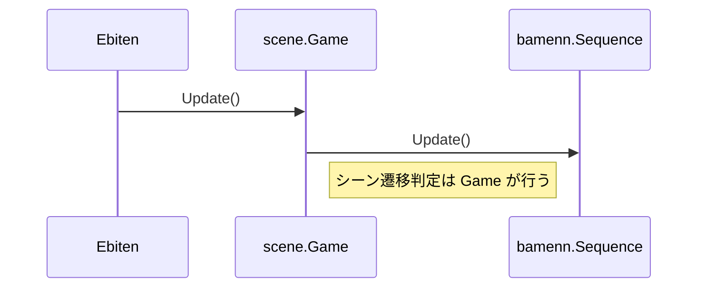

# プロジェクト設計概要

このドキュメントは、コードリーディングを支援する目的で現時点のゲームプログラムの構造と役割をまとめたものです。ソースコードを読み進める際のガイドとして参照してください。問題点・改善点に関してはメモのみを残し、コード修正は行っていません。

---

## 1. ディレクトリ / パッケージ構成

| ディレクトリ | 主な内容 |
|--------------|----------|
| `app` | エントリポイント (`main.go`)。Ebiten の `RunGame` に `scene.Sequence` を渡してゲームループを開始する。 |
| `scene` | タイトル・メインゲーム・リザルトの 3 シーンと、`bamenn.Sequence` を使ったシーン管理 (`sequence.go`) を実装。 |
| `component` | UI ウィジェットやゲーム画面を構成する小さな部品 (`Calendar`, `CardDeck`, `GameMain`, など)。Ebiten の `Draw` をそれぞれが持つ。 |
| `screen` | `GameMain` 内で切り替わるサブ画面 (`MapScreen`, `DiplomacyScreen`, `BattleScreen`) を保持。 |
| `system` | ドメインロジック (リソース管理、カード管理、戦闘計算など) を行うマネージャ群。UI とは疎結合。 |
| `entity` | ゲーム内オブジェクトの純粋データ表現 (カード、NPC 情報、マップポイントなど)。 |
| `core` | 予約ディレクトリ。現時点では空。 |
| `draw` | 未使用。将来的な描画リソース格納用？ |
| `test` | ルートに `game_test.go` が存在。BDD 形式 (コメントでテスト ID) で 900 行超の統合テストを実装。 |

---

## 2. 依存ライブラリ

- [Ebiten v2](https://github.com/hajimehoshi/ebiten) : ゲームエンジン。
- [Bamenn](https://github.com/noppikinatta/bamenn) : シーン管理 (`Sequence`) ライブラリ。

---

## 3. ゲームループとシーン遷移

1. `app/main.go` で `scene.CreateSequence()` を呼び出し `*Game` (内部的に `*bamenn.Sequence`) を生成。
2. Ebiten が `Update / Draw / Layout` を自動呼び出し。
3. `Game.Update()` 内で現在シーンを確認し、状態に応じて `Sequence.Switch()` でシーンを切り替える。

---

## 4. 各シーン詳細

### 4.1 Title (`scene/title.go`)
- 固定テキストとストーリーを表示。
- `Enter` キー入力があると `nextScene` を `"ingame"` に設定。

### 4.2 InGame (`scene/ingame.go`)
- **レイアウト** : 5 つの `component` を座標固定で配置。
  - `GameMain` : メイン領域 (520x280)
  - `ResourceView` : 画面上部に資源一覧 (520x20)
  - `Calendar` : 右上 (120x40)
  - `History` : 右側縦長 (120x320)
  - `CardDeck` : 画面下部 (520x60)
- **System Manager** を複数保持し、将来的に UI と紐付く予定。
  - `ResourceManager`, `TurnManager`, `CardManager`, `TerritoryManager`, `AllianceManager`, `CombatManager`

### 4.3 Result (`scene/result.go`)
- 勝利後にゲーム履歴を表示する簡易シーン。

---

## 5. Component レイヤ

| Component | 役割 | 主な public メソッド |
|-----------|------|----------------------|
| `ResourceView` | 資源 5 種の所持量を表示 | `GetResourceAmount`, `SetResourceAmount` |
| `Calendar` | 年月の表示・進行 | `AdvanceMonth`, `GetDisplayText` |
| `History` | 15 行までの履歴ログ表示 | `AddEntry`, `GetEntries` |
| `CardDeck` | 手札カードを水平レイアウトで描画 | `AddCard`, `GetCards` |
| `GameMain` | `screen` パッケージのサブ画面を切替 | `SwitchToScreen` |

---

## 6. Screen レイヤ

| Screen | 説明 |
|--------|------|
| `MapScreen` | 13x7 グリッドのワールドマップを生成。`system.MapGrid` と `system.Pathfinder` を保持。 |
| `DiplomacyScreen` | NPC との取引画面。`entity.Card` を生成し表示。 |
| `BattleScreen` | 前衛/後衛 5×2 スロットの簡易戦闘 UI を持つ。 |

---

## 7. System レイヤ

| Manager | 責務 |
|---------|------|
| `ResourceManager` | 資源の増減・支払い判定 |
| `TurnManager` | 年月とターン数カウント |
| `CardManager` | カードテンプレートの登録・生成 |
| `TerritoryManager` | 領土情報と資源生成処理 |
| `AllianceManager` | NPC との友好度と同盟ボーナス管理 |
| `CombatManager` | 戦闘ラウンド計算・報酬算出 |
| `MapGrid` / `Pathfinder` | マップポイントの生成と到達判定 |

---

## 8. Entity レイヤ

- **Card** : 名前・タイプ・コスト・攻守などを保持。
- **NPCInfo** : NPC 国の基礎情報と友好度。
- **Point** : マップ上の座標と種類 (Home / Wild / NPC / Boss)。

---

## 9. テスト (`game_test.go`)

- 合計 16 セクション以上のユニット / 統合テスト。
- レイアウトやロジックの期待値をコード化しており、TDD 方針を示唆。

---

## 10. 既知の問題・メモ (修正せず記録のみ)

1. **更新ロジック未実装**
   - `InGame.Update()` が空。`TurnManager` や各 `Component` の更新が呼ばれていない。
2. **UI と System の同期不足**
   - `ResourceView` は独自の `resources` マップを持ち `ResourceManager` と分離。値の一貫性が崩れる可能性。
3. **MapGrid 乱数シード**
   - `generatePoint()` 内でループ毎に `rand.Seed()` を呼び出しており、実行時点の時間依存で各セルの乱数が偏る懸念。
4. **Pathfinder の実装簡易**
   - `IsPointAccessible` が距離 ≤3 だけで判定。ボス到達条件や敵制圧状況を考慮していない。
5. **Combat と UI の二重構造**
   - `screen.BattleScreen` と `system.CombatManager` がそれぞれ戦闘フィールドを保持。状態同期が必要。
6. **CardManager テンプレート未使用**
   - 現状、カード生成時は `component.CardDeck` が独自に文字列を保持し、テンプレートを活用していない。
7. **Alliance Bonus の適用処理未実装**
   - `AllianceManager.updateAllianceBonuses()` で計算したボーナスが `ResourceManager` や戦闘計算に反映されていない。
8. **描画位置ハードコード**
   - すべてのウィジェットが絶対座標でハードコード。解像度変更や UI 拡張時に修正が大規模化する恐れ。
     - 問題なし。このゲームはゲームジャム用なので、急いで作る必要がある。
9. **並列処理・チャネル未使用**
   - ゴルーチンは使われておらず、将来的な重い戦闘計算でフレーム落ちの可能性。
     - 問題なし。このゲームは重くする予定はない。後ルーチンはできるだけ使わないこと。
10. **音声・アセットなし**
   - 音楽・効果音・画像を使用しておらず、プレイフィール向上の余地あり。
     - 現時点では問題なし。まずはゲームループを完成させる必要がある。

---

以上。
